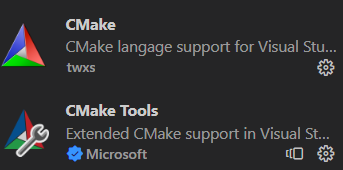

# Raspberry Pico on Windows

This repository provides a simple executable script to get the Raspberry Pico working on your Windows device **without** the use of a **WSL**!  
This allows you to get full **COM-Port** functionality and also **compile and flash** functionality on the same machine.  

## Pre-Requirements

You will need to install and setup some software for the script to work properly.
  
---
  
### 1. GIT-SDK

> Download using this link: [click](https://github.com/git-for-windows/build-extra/releases/latest)

**IMPORTANT**  

Install this to a location you can find easily, because you can fully remove this afterwards. It is not needed to use the Pico afterwards. 

---

### 2. Python >=3.7

> Download using this link: [click](https://www.python.org/ftp/python/3.11.2/python-3.11.2-amd64.exe)

If prompted **add Python to the PATH** variable for **all** users.

---

### 3. Visual Studio Build-Tools

> Download using this link: [click](https://visualstudio.microsoft.com/de/thank-you-downloading-visual-studio/?sku=Community&channel=Release&version=VS2022&source=VSLandingPage&cid=2030&workload=dotnet-dotnetwebcloud&passive=false#dotnet)

After installation open **Visual Studio Installer** and install **Visual Studio Community**.

In the next screen we need two workload packages. 
- Desktop development with C++
- Development for universal windows platform


This will take a while to install. You will need to keep these on your machine, since these will be your build tools to build Pico applications.

> Important Step!

You need to open **Developer Command Prompt for VS20xx**, the app will look something like this.


Once the console is open enter in:
> `where nmake`

The output should look something like this


Add this path to your System PATH without the `\nmake.exe` of course. So for my example I would have to add:   
`B:\Programme\Visual Studio\IDE\VC\Tools\MSVC\14.34.31933\bin\Hostx86\x86`  
to my System PATH.  

Now you can open any other terminal and simply enter 
> `nmake`

The output should look like this:


---
---

## Executing the script

Now you can decide where your Pico-Enviroment should be located. This should be a place where it can stay!

Copy these files to your desired location:


Now you need to open up the GIT-SDK we installed earlier. There should be an icon with the name **Git SDK 64-bit** on your desktop. 

> Important: Open the terminal **with admin** privileges

Otherwise, the script can not properly set your System Variables.

Now Navigate to the folder you moved to files to using the ``"cd"`` command in the terminal. 

Execute the script using:

> `bash setup_env.sh`

After the script is done add the prompted paths to your own path variable!

---
---

## Setting up VS Code

---

### 1. Extension setup

First download the following extensions



Now to configure them correctly. Open up your user `settings.json`. You can to this be pressing `Strg + Shift + P` and your Keyboard and typing in `settings.json`. Now select the option which is named **user settings**. In this file add the following lines: 

```json
"cmake.configureEnvironment": {
        "PICO_SDK_PATH": "${env:PICO_SDK_PATH}"
},
"cmake.generator": "NMake Makefiles",
"cmake.configureOnOpen": true,
```

This will use `NMake` as your Makefile generator, set the PICO-SDK-PATH using the environment variable from the script and also auto-generate the configuration on save. 

---

### 2. Selecting build tool

Open up VS Code in the root directory of the `pico-examples` directory. The CMake extension should instantly try to configure the project. This might fail on your machine, that is why we installed the Visual Studio Build Tools beforehand.  

To change the build tools again press `Strg + Shift + P` and type in `cmake: select a kit`. This will bring up a menu which will look a little something like this:


If your list does not contain the last four entries then select `[Scan for kits]` and try again. Now select one of the two compilers with `amd64_x86` or with `x86_amd64` in its name. If one of the two does not work, then try the other one. 

---

### 3. Testing

Now you are all set, all you have to do is press the little `build`-Button at the bottom of the VS Code window and everything should build just fine.

---
---

## Sample CMakeLists.txt

I also provided a simple CMake List file which you can use to quickly setup your own project. It is provided in `samples`.

---

## VS Code can't find my libs after building?

I also provided a `c_cpp_properties.json` file to get you started for this issue. It is also located under `sample/.vscode`. Afterwards press `Strg + Shift + P` and enter `intellisense`. Now press enter on **Restart intelliSense for active file** while being in the file in question. It should work right ahead after building again.  
Essentially you only need to add 
```json
"${env:PICO_SDK_PATH}/**"
```
to your ``includePath`` in your existing configuration. 

---

Happy Building